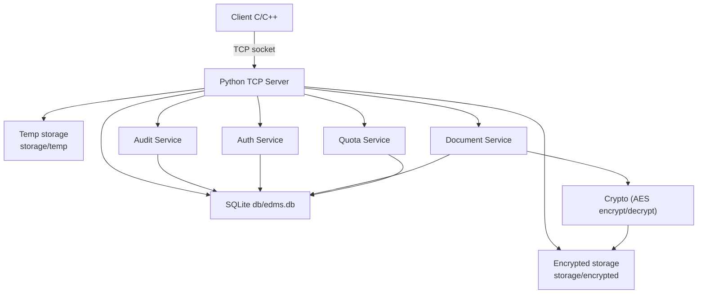
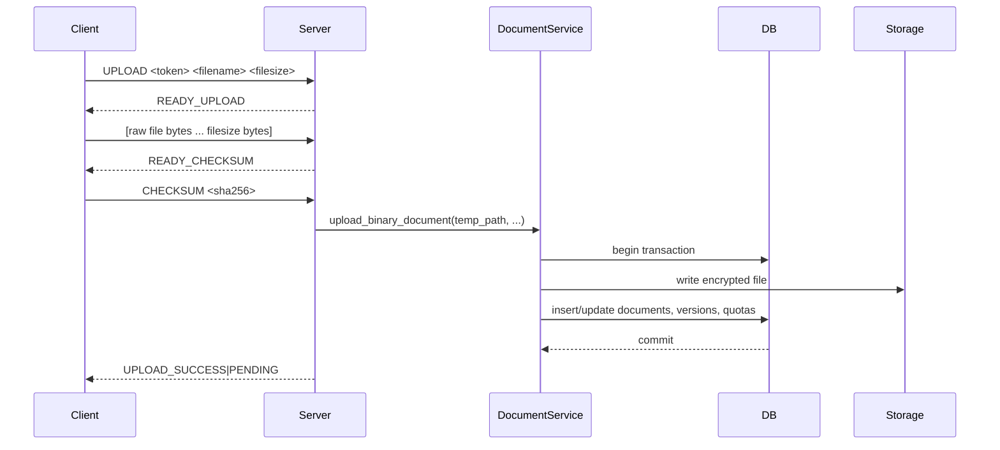
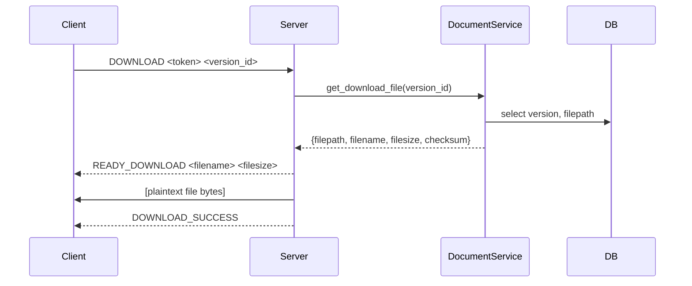

# Hệ thống Quản lý Tài liệu Doanh nghiệp (Enterprise Document Management System)

Mô tả: Server Python + Client C/C++ giao tiếp qua TCP socket. Hệ thống mô phỏng nghiệp vụ quản lý tài liệu của một công ty: đăng nhập & phân quyền, quản lý theo phòng ban, upload/download có quy trình phê duyệt, versioning, audit log, quota, và xử lý giao dịch nhiều bước.

## **Project Structure**
- **`server/`**: Server Python (entry: `server/main.py`, chính: `server/server.py`).
- **`server/db/`**: SQLite schema & seed (`schema.sql`, `seed.sql`), database helper (`database.py`).
- **`server/storage/`**: `encrypted/` (file đã mã hóa), `temp/` (tệp tạm trong quá trình upload).
- **`client/`**: Client C++ (Windows sockets + OpenSSL SHA).  
- **`tests/`**: Bộ kiểm thử nghiệp vụ (pytest).

## **Tổng quan tính năng (đã implement)**
- Đăng nhập / phân quyền: `admin`, `manager`, `staff` (`server/auth.py`).
- Quản lý tài liệu theo phòng ban, versioning (bảng `documents`, `document_versions`).
- Quy trình upload → trạng thái `pending` → manager `approve`/`reject` (`server/document.py`, `server/server.py`).
- Chỉ `approved` mới được download.
- Mã hóa file khi lưu (AES-CBC) — mã hóa tại nghỉ (at-rest) bằng `server/crypto.py`.
- Audit log ghi lại `UPLOAD`, `APPROVE`, `REJECT`, `DOWNLOAD` vào bảng `audit_logs` (`server/audit.py`).
- Quota cá nhân & phòng ban kiểm tra trước khi lưu file (`server/quota.py`).
- Multi-step upload: server nhận metadata (UPLOAD), nhận dữ liệu tạm, kiểm tra checksum, commit hoặc rollback (`server/server.py` → `handle_upload`).

## **Các tính năng chưa implement**
- Xử lý xung đột (race condition).
- Tải lại khi mất kết nối (resume).

## **Giao thức TCP / Lệnh chính**
Server trả/nhận chuỗi ASCII (phân tách bằng khoảng trắng / newline). Các lệnh chính:

- `LOGIN username password` → `LOGIN_SUCCESS|<token>` hoặc `LOGIN_FAILED`.
- `LOGOUT <token>` → `LOGOUT_SUCCESS` hoặc `INVALID_TOKEN`.
- `UPLOAD_FILE <token> <filepath>` → server trả `READY_UPLOAD`, client gửi *filesize* byte; sau đó server trả `READY_CHECKSUM` và client gửi `CHECKSUM <sha256>` → server trả `UPLOAD_SUCCESS|PENDING` hoặc lỗi.
- `LIST_PENDING <token>` → trả danh sách version pending (manager/admin).
- `APPROVE <token> <version_id>` / `REJECT <token> <version_id>` → trả `APPROVE_SUCCESS` / `REJECT_SUCCESS` hoặc lỗi.
- `LIST_AVAILABLE <token>` → danh sách tài liệu `approved` trong phòng ban.
- `DOWNLOAD_FILE <token> <version_id> <path>` → server trả `READY_DOWNLOAD <filename> <filesize>` rồi gửi (giải mã) nội dung file, cuối cùng trả `DOWNLOAD_SUCCESS`.
- `LIST_AUDIT <token>` → admin xem audit logs.
- `LIST_VERSIONS <token> <filename>` → liệt kê các version của file trong phòng ban.

## **Bảo mật & Session**
- Session token được tạo tại đăng nhập và lưu trong bộ nhớ trên `AuthService` (`server/auth.py`). Hiện chưa có cơ chế `expiration` 
- AES: `server/crypto.py` dùng PyCryptodome (module `Crypto`) với `AES.MODE_CBC`.
- Passwords trong seed hiện là chuỗi thô (`password_hash` dùng trực tiếp).

## **Database & Seed**
- DB SQLite mặc định: `db/edms.db` (helper: `server/db/database.py`).
- Khởi tạo schema + dữ liệu mẫu: `server/init_db.py` (chạy sẽ tạo lại DB từ `db/schema.sql` + `db/seed.sql`).
- Bảng quan trọng: `departments`, `users`, `documents`, `document_versions`, `audit_logs`.

## **Quota**
- Quota mặc định (xem `db/seed.sql`): department và personal (bytes). 1GB = `1073741824` bytes (ví dụ cho IT), personal quota ví dụ 200MB.
- Trước khi lưu, server gọi `QuotaService.check_user_quota` và `check_department_quota` để quyết định accept/reject.

## **Chạy thử (local, từ thư mục `src/`)**
1. Tạo venv (Windows):

```
python -m venv .venv
.\.venv\Scripts\activate
```

2. Cài phụ thuộc tối thiểu:

```
pip install pycryptodome pytest
```

3. Khởi tạo DB:

```
python server/init_db.py
```

4. Chạy server:

```
python -m server.main
```

5. Biên dịch client (Windows / MSVC ví dụ):

```
:: Mở Visual Studio Developer Command Prompt
cl /EHsc client\client.cpp client\main.cpp /link ws2_32.lib libcrypto.lib

```

Trên POSIX (nếu code client ported):

```
g++ -std=c++17 client/client.cpp client/main.cpp -o client -lssl -lcrypto
```

6. Chạy tests (từ `src/`):

```
pytest -q
```

## **Kịch bản kiểm thử nghiệp vụ (đã có tests)**
- Upload file → pending → manager approve → download (tests/test_upload_approve.py).
- Upload trùng tên → tạo version mới (tests/test_versioning.py).
- Manager reject → kiểm tra trạng thái (tests/test_reject.py).
- Staff không được download tài liệu phòng ban khác (tests/test_department_permission.py).
- Admin xem tất cả tài liệu và audit log (tests/test_admin_access.py, tests/test_quota.py).


## **Sơ đồ kiến trúc hệ thống**



Sơ đồ: Client kết nối đến Python TCP Server qua socket TCP. Server chia thành các service (`AuthService`, `DocumentService`, `AuditService`, `QuotaService`) và tương tác với SQLite (`db/edms.db`) và bộ nhớ lưu trữ mã hóa (`storage/encrypted`). Mã hóa/giải mã file được thực hiện bởi `server/crypto.py` trước khi lưu/đọc file.

## **Giao thức truyền thông (chi tiết & sequence)**

Upload (multi-step):



Download:



Ghi chú giao thức:
- Mọi lệnh yêu cầu `token` để xác thực (server trả `INVALID_TOKEN` nếu không hợp lệ).
- Server trả các trạng thái trung gian (`READY_UPLOAD`, `READY_CHECKSUM`, `READY_DOWNLOAD`) để đồng bộ bước gửi/nhận dữ liệu thô.

## **Quy trình nghiệp vụ (flow)**

1. `staff` đăng nhập (`LOGIN`) và upload file → phiên bản mới được tạo với trạng thái `pending`.
2. `manager` của phòng ban chạy `LIST_PENDING` để nhận các phiên bản cần phê duyệt.
3. `manager` chạy `APPROVE` hoặc `REJECT` trên `version_id`; hành động này được ghi vào `audit_logs`.
4. Chỉ `approved` mới xuất hiện trong `LIST_AVAILABLE` và cho phép `DOWNLOAD`.
5. `admin` có thể `LIST_AUDIT` để xem lịch sử đầy đủ.

## **Cách xử lý versioning**

- Bảng `documents` gom các phiên bản cùng `filename` trong cùng `department_id`.
- Khi upload có `filename` trùng trong cùng phòng ban: server kiểm tra `MAX(version_num)` và tăng `version_num +1` (xem `server/document.py`).
- Mỗi bản (`document_versions`) lưu: `uploaded_by`, `upload_time`, `status` (`pending|approved|rejected`), `filepath` (đường dẫn file mã hóa), `filesize`, `checksum` (SHA256).
- `LIST_VERSIONS` trả các bản sắp xếp theo `version_num DESC`.

## **Xử lý giao dịch nhiều bước (transactions & rollback)**

Chiến lược chính:

- Bước tạm & xác nhận checksum: server nhận file vào `storage/temp/<uuid>.tmp` rồi tính SHA256. Sau đó server so sánh với `CHECKSUM` do client cung cấp — nếu khác, server xóa temp và trả lỗi `CHECKSUM_MISMATCH`.
- Việc commit thực tế gồm: mã hóa file (gọi `encrypt_data` trong `server/crypto.py`) → ghi file mã hóa vào `storage/encrypted/<uuid>.bin` → thực hiện các thay đổi DB (chèn `documents` nếu cần, chèn `document_versions`, cập nhật quota người dùng & phòng ban) trong một giao dịch DB (`conn` + `commit`/`rollback`).
- Nếu bất kỳ lỗi nào xảy ra trong bước DB hoặc ghi file mã hóa, `upload_binary_document` sẽ gọi `conn.rollback()` và xóa file đã ghi (nếu có) — đảm bảo rollback cho cả filesystem và DB ở mức có thể.

## **Ghi chú xử lý lỗi & giới hạn hiện tại**
- Nếu client ngắt kết nối trong lúc upload (bytes_received != filesize), server xóa temp và trả `UPLOAD_INCOMPLETE`.
- Quota được kiểm tra trong `upload_binary_document` — nếu vượt quota, hàm ném lỗi và upload bị rollback.

---
